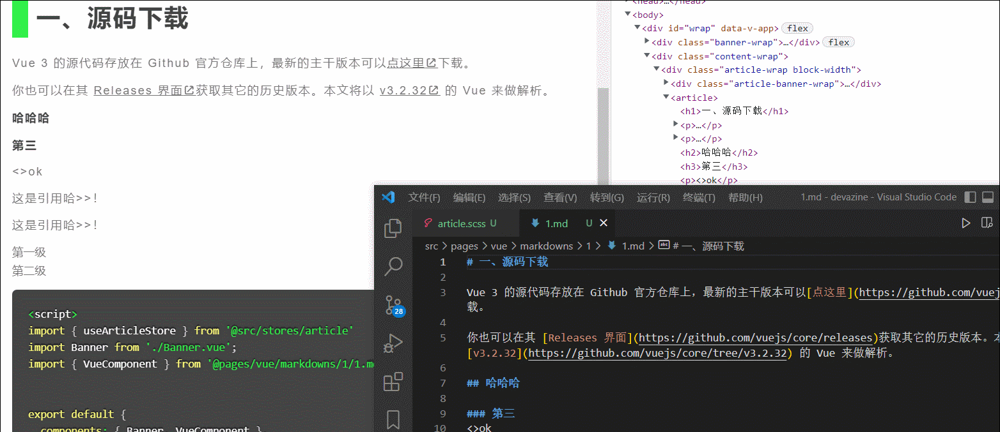

# vite-plugin-markdown-with-prismjs

A [vite-plugin-markdown](https://github.com/hmsk/vite-plugin-markdown) based plugin enables you to import a Markdown file as various formats **with customized classes & [Prismjs](https://prismjs.com/) processing** on your vite project.



## 1. Setup

```
npm i -D vite-plugin-markdown-with-prismjs
```

## 2. Guidelines 

### Config

```js
// vite.config.js
/** commonjs **/
const mdPlugin = require('vite-plugin-markdown-with-prismjs');
const options = {mode: 'html'};

module.exports = {
  plugins: [mdPlugin(options)]
}

/** esm **/
import mdPlugin from 'vite-plugin-markdown-with-prismjs'
module.exports = {
  plugins: [mdPlugin.plugin(options)]  // using mdPlugin.plugin API under esm mode
}
```

### Markdown File
We now can add customized classes to the HTML wrapping by writing `${classes}` in the end of each block's content.

> Btw, `[toc]` syntax is optional supported as well. You sholud write '[toc]' on top as using this featrue.

```md
[toc]

# title with multi customized classes${class-a,class-b}

- list item
- list item with customized class${class-c}

[link example${class-d}](//web.com)

# img example: 


## sub title

### sub-sub title

> quote...${f}

codes will be processed by **Prism.js${g}** eventually${h,i}

'''js
var a = 1
console.log(a)
${j,k}
'''
```

output:

```html
  <ul class="toc-container">
    <li class="level-1">title with multi customized classes</li>
    <li class="level-1">img example:</li>
    <li class="level-2">sub title</li>
    <li class="level-3">sub-sub title</li>
  </ul>
  <h1 class="class-a class-b">title with multi customized classes</h1>
  <ul>
    <li>list item</li>
    <li class="class-c">list item with customized class</li>
  </ul>
  <p><a href="//web.com" class="class-d">link example</a></p>
  <h1>img example:</h1>
  <p></p>
  <h2>sub title</h2>
  <h3>sub-sub title</h3>
  <blockquote class="f">
    <p>quote...</p>
  </blockquote>
  <pre class="j k"><code class="language-js"><span class="token keyword">var</span> a <span class="token operator">=</span> <span class="token 
    number">1</span>
    console<span class="token punctuation">.</span><span class="token function">log</span><span class="token punctuation">(</span>a<span class="token punctuation">)</span>
    </code></pre>
```


## Module

```js
import { html } from './contents/the-doc.md';

console.log(html)
```

## 3. Extended Options

```js
disableCustomizedClass?: boolean = false
disableDecodeEntry?: boolean = false
classPrefix?: string = ''
```

More detail of the original `Options` see [vite-plugin-markdown#options](https://github.com/hmsk/vite-plugin-markdown#options).

## License

MIT
